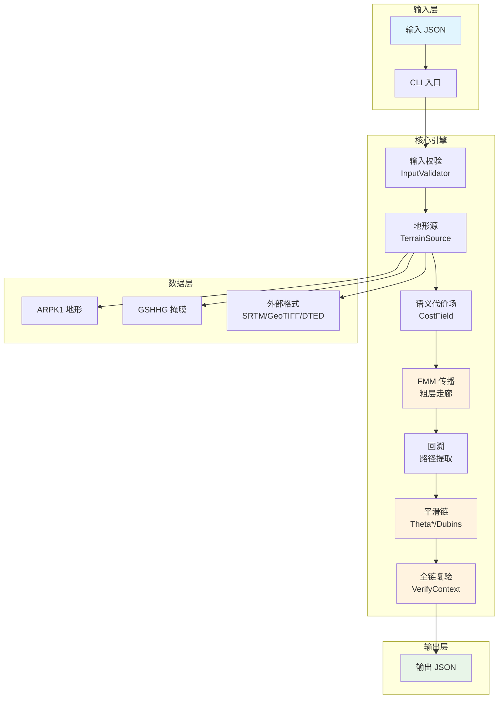
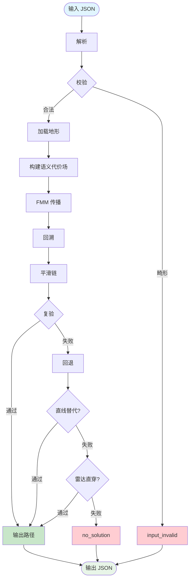

# 01 — 项目概览与系统架构

> 系列文档第 1 篇。面向技术人员：先看本篇建立全局认知，再按需深入各模块文档。

## 1. 项目是什么

**AircraftRouterPlanner** 是一个**确定性 3D 航路规划 CLI 引擎**（Rust 实现，2024 edition）：输入蓝方兵力/武器、红方雷达/地空导弹部署、禁飞/限飞区、地形数据与飞行器性能参数，输出每架飞机的航路点集（经纬度 + MSL 高度）。

核心定位一句话：

> 在保证自身安全（不撞山、不越禁飞/限飞区、满足机动约束）的前提下，规划进入**武器发射阵位**（而非贴目标点）的航路，并规避红方雷达探测。

### 1.1 关键特性速览

| 特性 | 说明 |
|------|------|
| 分层解耦 | 粗层 FMM 代价场（定走廊）→ 细层运动基元/平滑（保可行）→ 全链复验 |
| 确定性 | 固定种子逐位可复现（跨平台），构建期禁 FMA + 固定 target-cpu |
| 性能硬指标 | 每百公里 ≤ 3s（端到端，典型值），绝对不能崩溃（B9） |
| 多机支持 | `aircraft` 数组，一次代价场共享、每机独立 FMM 回溯 |
| 多源地形 | SRTM/HGT、GeoTIFF、DTED/DTED2、自建 ARPK1 紧凑格式（Zstd） |
| 威胁建模 | 球形雷达 + 二值检测 + LOS 地形遮蔽 + 多雷达（任一探测即探测） |
| 输出契约 | `status` 四态（success / degraded_timeout / no_solution / input_invalid） |
| 交付形态 | 单二进制（stdin/stdout JSON 管道）+ 默认地形/掩膜文件 |

## 2. 目标与硬指标

| 指标 | 定义 | 出处 |
|------|------|------|
| 性能 B8 | 每百公里 ≤ 3s（端到端 wall-clock）；航程按比例线性外推 | 方案 5.1 |
| 崩溃 B9 | 绝对不能崩溃；崩溃 = panic/段错误/OOM | 方案 5.2 |
| 确定性 | 相同种子输出逐位一致（跨平台） | 方案 5.2 |
| 交付 | 单二进制（Linux musl / Windows MSVC 静态）+ 内置地形数据文件；纯 Rust 零 C 依赖 | 方案 1.3 |

## 3. 技术选型

### 3.1 语言：Rust（2024 edition）

Rust 满足三条硬性需求：性能（无 GC、零成本抽象）、确定性（无未定义行为）、交付（cargo 交叉编译生态）。

### 3.2 依赖清单（全部纯 Rust）

| 库 | 用途 | 版本锁定 |
|----|------|---------|
| serde / serde_json | JSON 契约 | ^1 |
| rand | 确定性随机 | ^0.10 |
| nalgebra | 3D 向量/矩阵基元 | 0.35（禁 blas） |
| rstar | R-Tree 空间索引 | ^0.12 |
| geo（含 geo-types） | 测地线距离/方位 | 0.33.1 |
| thiserror | 错误类型 | ^2 |
| clap | CLI 参数 | 4.6 |
| geotiff | GeoTIFF 读取 | 0.1 |
| dted2 | DTED/DTED2 读取 | 1.0.0 |
| ruzstd | 纯 Rust Zstd 解码 | 0.7 |
| sha2 | SHA-256 校验 | 0.10 |

**静态编译红线**：① nalgebra 仅默认特性禁 blas；② geo 不启用 proj feature；③ flate2 保持 rust_backend；④ ruzstd 纯 Rust。CI 用 `cargo tree -e normal` 断言零 C 依赖。

## 4. Cargo Workspace 结构

```
AircraftRouterPlanner/
├── Cargo.toml            # workspace 根
├── .cargo/config.toml    # 确定性构建 flags
├── src/
│   ├── cli/              # ★ 核心 CLI（lib + bin）
│   ├── convert/          # 内部地形转换工具（不随核心发布）
│   └── demo/
│       ├── server/       # Axum 后端（开发期可视化）
│       └── web/          # React/Three.js 前端（pnpm）
├── data/                 # 地形/掩膜数据（gitignore）
└── install/              # 发布包结构
```

## 5. 系统架构图



## 6. 分层架构


**优先级**：安全（不撞山/不越禁飞）> 运动学约束 > 美化

## 7. 端到端数据流



## 8. 当前状态（v0.21）

### 已完成

- 核心算法：FMM + 语义代价场 + 回溯
- 平滑链：Theta\*/Chaikin/Catmull-Rom/Dubins（含 CCC）/贪心抽稀
- 威胁模型：球形雷达 + 二值检测 + LOS 遮挡
- 多机支持：共享代价场 + 每机独立 FMM
- 武器环带目标：FMM 传播到环带即停
- 垂直剖面：起终点贴地 + 方案 B 中间锚点 + 地形跟随插点 + 爬升率约束
- 输入契约 v0.21：拍平结构、逐机目标、武器移入飞行器、统一 zones 数组
- 地形数据索引：`data/index.yaml` 索引 id 驱动

### 关键设计决策

- **status 四态**：success / degraded_timeout / no_solution / input_invalid
- **不交付违禁路径**：平滑全失败 + 直线替代均失败 → no_solution（不交付 raw）
- **输入点越界不报错**：OOB 按高代价通行，降级警告
- **禁飞区无高度范围**：全高度禁入，限飞区必须提供高度区间
- **二值检测**：范围内 + LOS 未遮蔽 = 必定探测（p=1.0），否则 p=0

## 9. 测试与验证

- **崩溃套件 B9**：畸形/退化输入不 panic，CI 一票否决
- **确定性验证**：两跑 path-sha256 逐位一致
- **回归套件**：34 个历史 bug 输入 JSON，自动发现纳入
- **性能预算**：每百公里 ≤ 3s，超时返回部分结果（degraded_timeout）