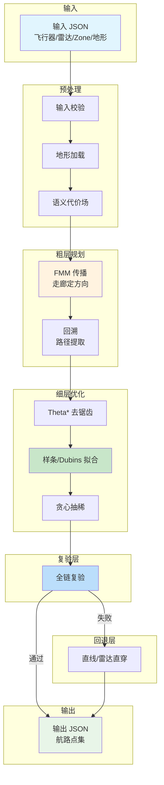
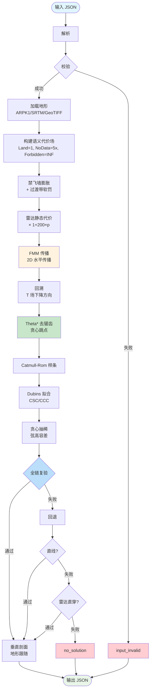
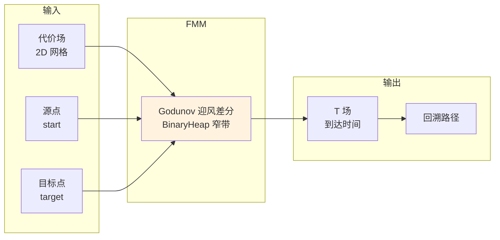
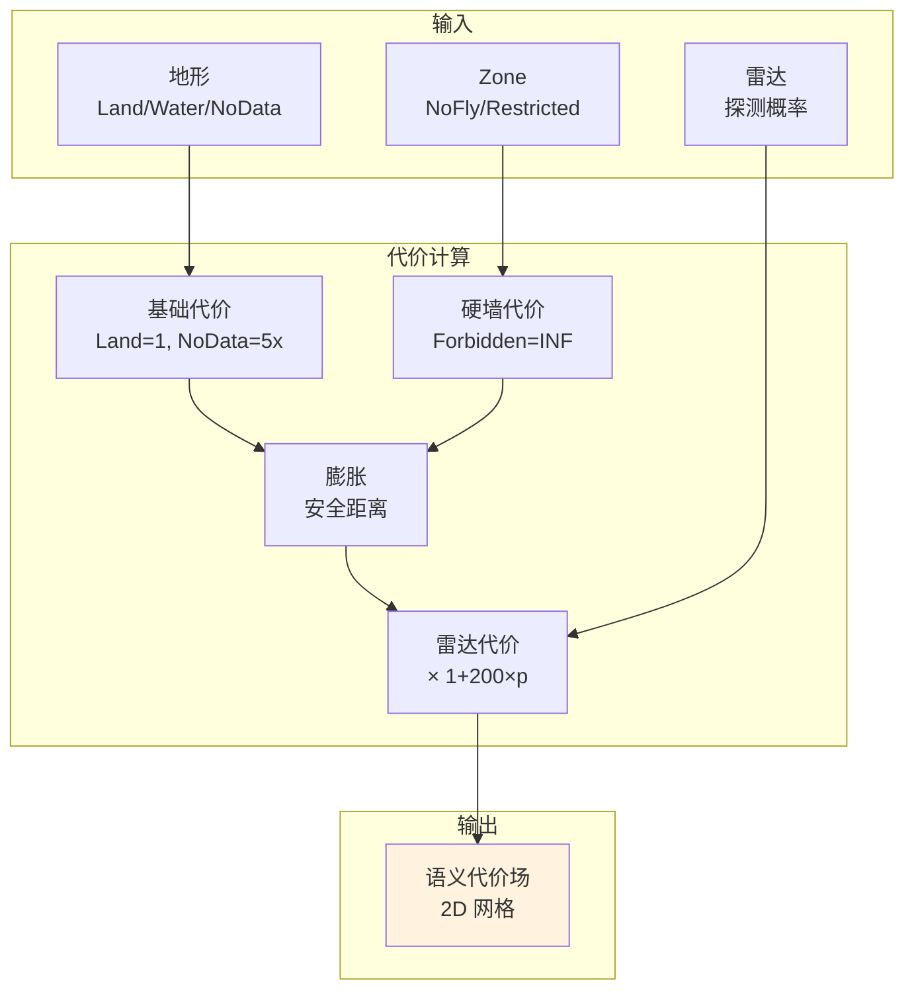
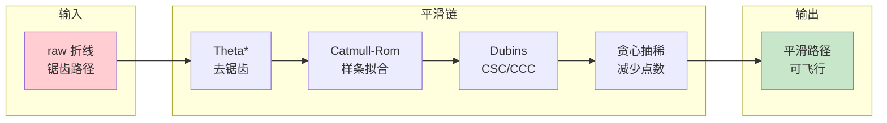
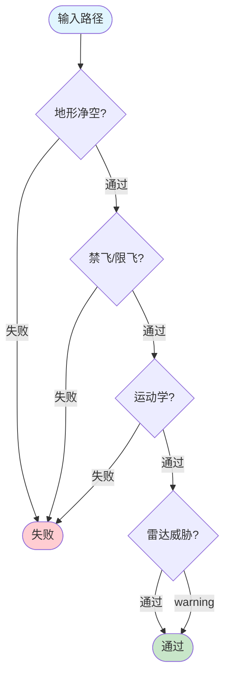
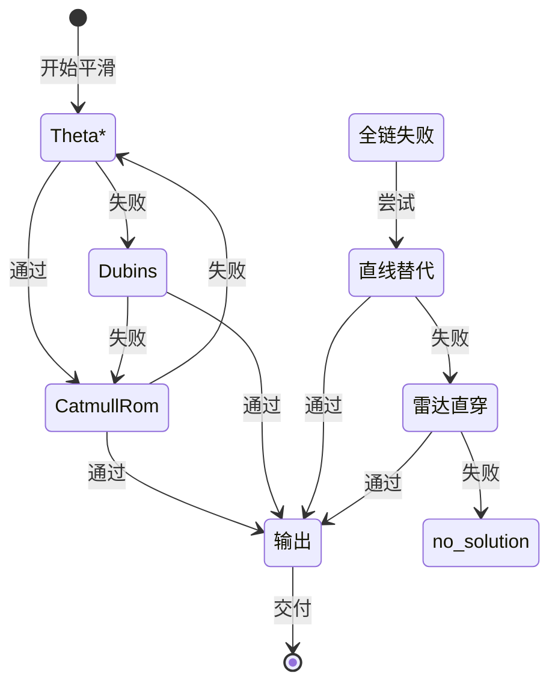
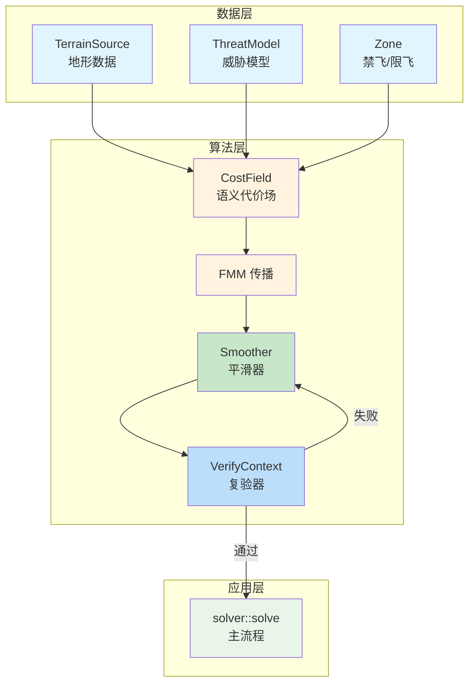

# 算法概览 — 航路规划核心算法与处理流程

> 本文档总体概括 algorithms 目录下的核心算法，描述从输入到输出的完整处理流程及每个环节的作用。

## 1. 算法全景

## 2. 处理流程详解

### 2.1 完整流程图

### 2.2 流程阶段说明

| 阶段 | 作用 | 关键算法 |
|------|------|---------|
| **输入校验** | 拦截畸形/退化输入 | InputValidator |
| **地形加载** | 加载地形数据（ARPK1/SRTM/GeoTIFF） | TerrainSource trait |
| **语义代价场** | 构建网格代价（Land=1, NoData=5x, Forbidden=INF） | build_semantic_cost_field |
| **禁飞墙膨胀** | 扩展安全距离 + 过渡带软罚 | apply_inflation_and_band |
| **雷达代价** | 探测概率叠加到代价场 | static_union_probability |
| **FMM 传播** | 粗层走廊定方向 | Godunov 迎风差分 |
| **回溯** | 从终点沿 T 场下降提取路径 | backtrack_path |
| **Theta\*** | 去锯齿，贪心跳点简化 | theta_star_smooth |
| **样条/Dubins** | 平滑拟合 | Catmull-Rom / Dubins CSC/CCC |
| **贪心抽稀** | 减少路径点数 | greedy_simplify |
| **全链复验** | 验证安全性/运动学 | verify_path |
| **垂直剖面** | 地形跟随 + 爬升率约束 | apply_vertical_profile |

## 3. 核心算法详解

### 3.1 FMM（快速行进法）

**作用**：粗层走廊规划，确定路径大方向。

**核心思想**：从源点向外传播，每个格点记录到达时间，终点沿 T 场下降方向回溯得到路径。

**确定性保证**：HeapEntry 的 Ord 实现反转比较，tie-break 固定 idx。

### 3.2 语义代价场

**作用**：将地形/Zone/雷达信息编码为网格代价，指导 FMM 传播。

**三层叠加**：
1. 语义层：Land/Water/Lake=1.0，NoData/OOB=5x，Forbidden=INF
2. 膨胀层：禁飞墙向外扩展 + 过渡带软罚
3. 雷达层：探测概率叠加到代价

### 3.3 平滑链

**作用**：将 FMM 输出的折线路径平滑为可飞行路径。

**算法选择**：
- **Theta\***：LOS 捷径简化，贪心跳点
- **Catmull-Rom**：样条插值，保持曲率连续
- **Dubins**：CSC 四类型 + CCC 三圆弧，满足转弯半径约束
- **贪心抽稀**：弦高容差内减少点数

### 3.4 全链复验

**作用**：验证路径安全性/运动学约束，不满足则回退。

**复验清单**：

| 检查项 | 作用 | 机型 |
|--------|------|------|
| 地形净空 | 防撞山 | 两机型 |
| 禁飞/限飞 | 防越界 | 两机型 |
| 航向连续性 | 防急转 | 固定翼 |
| 转弯半径 | 满足机动约束 | 固定翼 |
| 爬升角 | 满足爬升能力 | 固定翼 |
| 弦高 | 保持路径质量 | 两机型 |
| 雷达威胁 | 软告警 | 两机型 |

### 3.5 回退机制

**作用**：平滑失败时尝试替代方案，最终保证不交付违禁路径。

**关键决策**：不交付违禁路径——平滑全失败 + 直线替代均失败 → no_solution。

## 4. 算法模块关系

## 5. 关键设计决策

| 决策 | 原因 |
|------|------|
| **确定性** | 固定种子逐位可复现，构建期禁 FMA + 固定 target-cpu |
| **分层解耦** | 粗层定方向，细层保可行，复验保安全 |
| **不交付违禁路径** | 安全优先，宁可 no_solution 也不给违禁路径 |
| **回退机制** | 平滑失败 → 直线替代 → 雷达直穿 → no_solution |
| **软硬约束分离** | 地形/禁飞硬约束，雷达软告警 |

## 6. 性能预算

| 环节 | 预算 | 说明 |
|------|------|------|
| FMM 粗层 | ~15% | 多机共享摊薄 |
| 雷达/禁飞查询 | ~30% | rstar 空间索引 |
| 平滑链 | ~20% | Dubins/样条拟合 |
| 复验 | ~35% | 全分辨率采样 |

**总体目标**：每百公里 ≤ 3s（端到端典型值）

## 7. 文档索引

| 文档 | 内容 |
|------|------|
| [02-代价场与FMM](./02-代价场与FMM.md) | 语义代价场构建、FMM 传播算法、空间索引 |
| [03-威胁模型](./03-威胁模型.md) | 雷达威胁建模、探测概率计算、LOS 判定 |
| [04-求解器与端到端流程](./04-求解器与端到端流程.md) | 求解器主流程、两轮 FMM、受限区决策 |
| [05-路径平滑与复验](./05-路径平滑与复验.md) | 平滑算法、Dubins 路径、全链复验 |