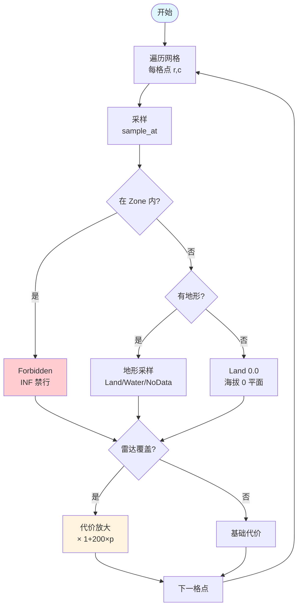
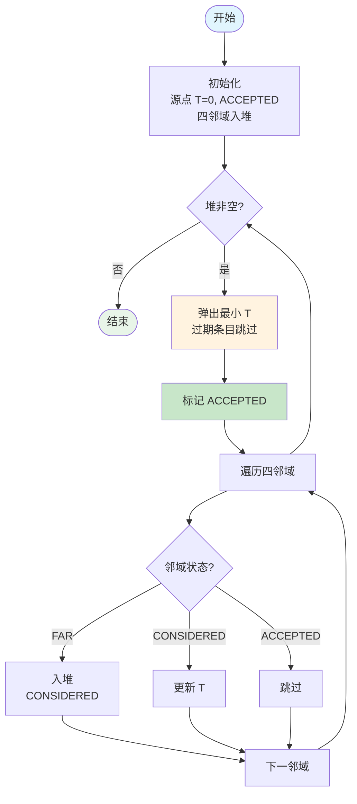
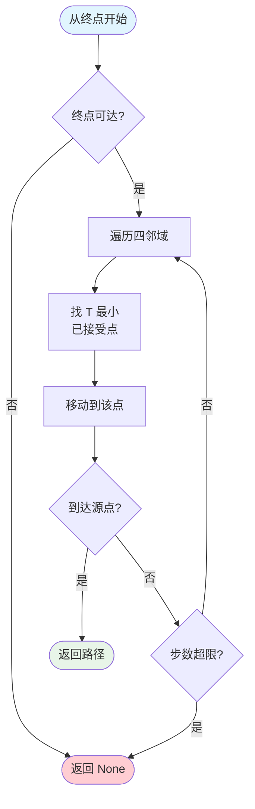
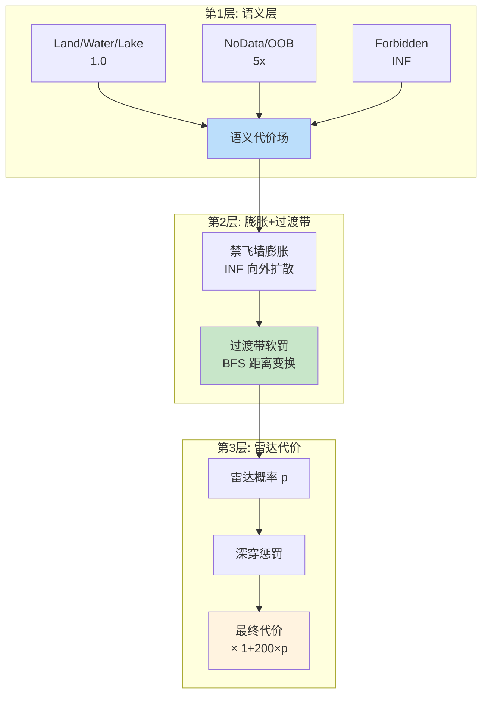

# 02 — 代价场与 FMM 传播、空间索引

> 本节描述代价场构建与 FMM 传播算法。

## 1. CostField（代价场数据结构）

```rust
pub struct CostField {
    pub rows: usize,
    pub cols: usize,
    pub cost: Vec<f32>,   // 行优先，cost ≥ 1，越大越难通过
}
```

**语义**：Land/Water/Lake → 1.0（基础代价）；NoData/OOB → 5x（高代价通行）；Forbidden（NoFly/Obstacle 硬墙）→ f32::INFINITY；雷达代价 → 乘性放大。

## 2. 语义代价场构建流程



## 3. FMM 传播—— 粗层主算法

**2D Godunov 迎风差分 + BinaryHeap 窄带**，O(NlogN)，确定性。

### 3.1 FMM 传播流程



### 3.2 Godunov 迎风更新

对格点 (r, c)，取四邻域**已接受**点的最小到达时间：

```
tx = min(上/下已接受点的 T)
ty = min(左/右已接受点的 T)
若 tx=∞ 且 ty=∞ → ∞
若 tx=∞ → ty + cost
若 ty=∞ → tx + cost
若 |tx−ty|² ≤ 2·cost²（对角支配）→ (tx + ty + √(2·cost² − (tx−ty)²)) / 2
否则 → min(tx, ty) + cost
```

### 3.3 确定性保证

`HeapEntry` 的 Ord 实现反转比较使小 T 优先级高，**tie-break 固定 idx**——迭代序与插入序无关，跨运行逐位一致。

### 3.4 防御

空网格 / 源点越界 → 返回空结果（times 全 INF、accepted 全 false），**不 panic**（B9）。

## 4. 回溯流程



从终点沿 **T 场最大下降方向**逐格回溯到源点。返回顺序：终点 → 源点（solver 中 reverse 后使用）。

## 5. 空间索引—— rstar 加速

### 5.1 RadarEntry（雷达索引）

- `RTreeObject::envelope`：半径 → 经纬度矩形上界
- `within(lon, lat, radius_m)`：R-tree 粗筛 + 球面距离精确过滤，**按 id 排序输出（确定性）**
- 非有限输入 → 空结果/None（不 panic）

### 5.2 CircleIndex（圆区域索引）

用于圆形禁飞/限飞区快速包含查询。`containing(lon, lat)`：所在圆集合，按 id 排序（确定性）。

### 5.3 确定性

查询结果一律 `sort_by(id)`——热路径不依赖无序迭代。

## 6. 代价场三层叠加



## 7. 测试覆盖

- costfield：常数场全可达、回溯到达源点、空网格/越界源不 panic
- spatial：within 半径过滤、最近雷达、圆包含、空索引不 panic
- crash_suite：FMM 空/越界、回溯退化输入