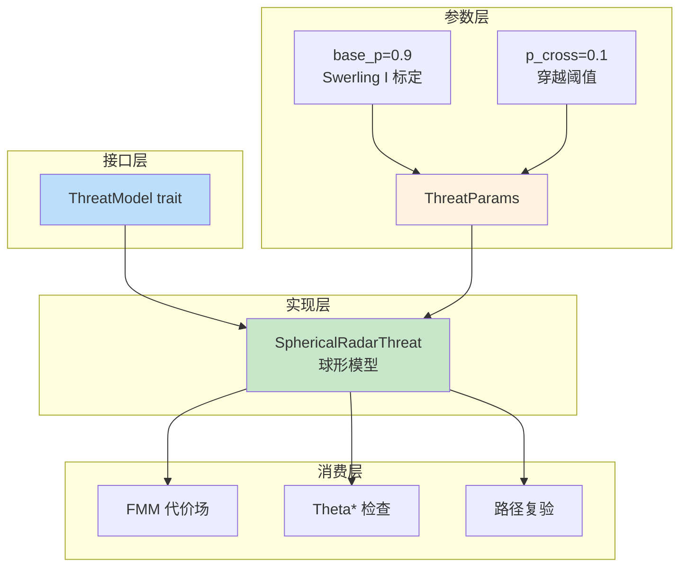
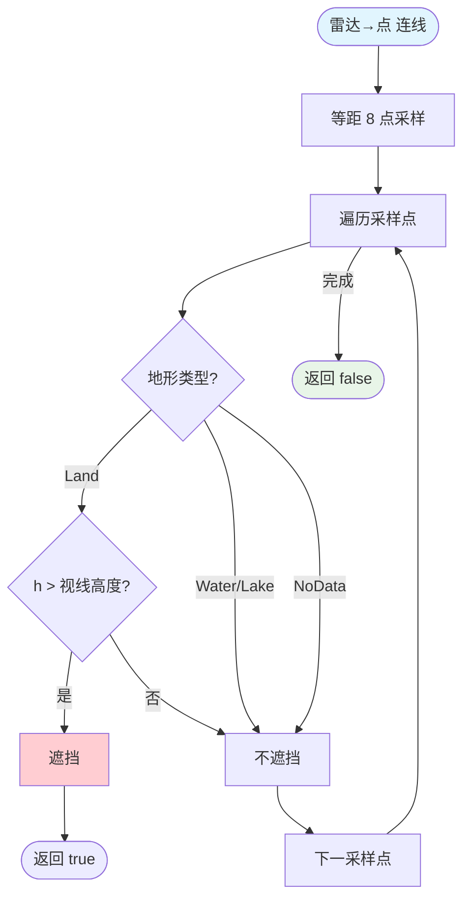
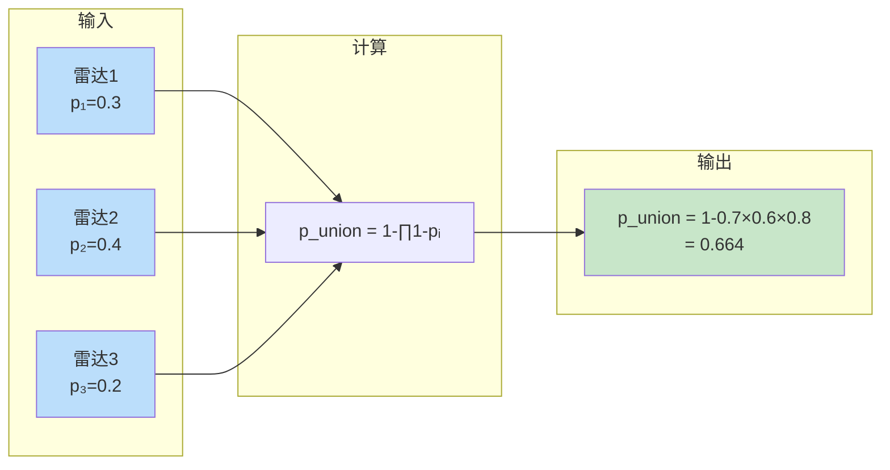

# 03 — 雷达威胁模型

> 设计依据：技术方案 4.2.1（雷达威胁代价形态/多雷达合成/压制）、4.3（ThreatModel trait）

## 1. 设计定位

威胁模型是"默认球形模型（保守探测范围上界）+ 探测概率必选接口"：

- 球形模型：水平距离 ≤ 有效半径内视为威胁
- **探测概率为必选模型**：飞机可以穿越雷达探测区，但必须评估探测概率（累计 ≤ P_cross）
- 多雷达重叠区：默认球体口径保持覆盖 max；探测概率档用**概率并集 `1−∏(1−pᵢ)`**
- LOS：地形遮挡雷达视线 → 该雷达不探测

## 2. 威胁模型架构



## 3. ThreatParams（威胁模型参数）

```rust
pub struct ThreatParams {
    pub radar_inflation: f64,    // 膨胀系数（默认 1.2）
    pub detection_curve: DetectionCurve, // Swerling1（默认）/ Exponential / Linear
    pub p_cross: f64,            // 穿越阈值（默认 0.1）
    pub suppression_delta: f64,  // 压制因子（默认 0.5）
    pub base_p: f64,             // 探测概率基准（已标定 0.9）
}
```

**base_p 标定（2026-08-13）**：Swerling I 典型监视雷达模型，Pfa=1e-6、R_eff 处 Pd=0.9、SNR₀=130.1≈21.1dB。距离衰减按雷达方程四次方。

## 4. 单点探测概率计算流程

```mermaid
flowchart TD
    START([计算点 lon,lat]) --> INIT[p_union = 0]
    INIT --> LOOP[遍历每个雷达]

    LOOP --> DIST[计算距离 d<br>haversine]
    DIST --> CHECK1{d > 有效半径?}
    CHECK1 -->|是| NEXT[下一雷达]
    CHECK1 -->|否| CHECK2{有地形?}

    CHECK2 -->|是| LOS{LOS 遮挡?}
    CHECK2 -->|否| CALC[计算概率]

    LOS -->|是| NEXT
    LOS -->|否| CALC

    CALC --> U[u = d / R_eff]
    U --> P[p = base_p × f(u)]
    P --> UNION[p_union = 1 - ×1-p_union× ×1-p]

    UNION --> NEXT
    NEXT --> LOOP
    LOOP -->|完成| RETURN([返回 p_union])

    style START fill:#e1f5fe
    style RETURN fill:#e8f5e8
    style CHECK1 fill:#fff9c4
    style LOS fill:#fff9c4
```

## 5. 检测曲线

```mermaid
graph LR
    subgraph 检测曲线
        SW[Swerling1<br>默认] --> FORMULA[f(u) = exp(-VT/1+SNR₀/u⁴) / base_p]
        EXP[Exponential] --> FORMULA2[f(u) = exp(-4u)]
        LIN[Linear] --> FORMULA3[f(u) = 1-u]
    end

    subgraph 数值效果
        CENTER[中心 u=0<br>p→1]
        HALF[半程 u=0.5<br>p≈0.993]
        EDGE[边缘 u=1<br>p=0.9]
        OUT[外部 u>1<br>p=0]
    end

    FORMULA --> CENTER
    FORMULA --> HALF
    FORMULA --> EDGE
    FORMULA --> OUT

    style SW fill:#c8e6c9
    style CENTER fill:#ffcdd2
    style HALF fill:#ffcdd2
    style EDGE fill:#fff3e0
    style OUT fill:#e8f5e8
```

## 6. LOS 判定流程



## 7. 多雷达概率并集



## 8. 雷达代价进入 FMM

```
对每格点:
    p = threat.static_union_probability(lon, lat)
    if p > 0 && cost 有限:
        u = threat.static_penetration(lon, lat, 0.0)
        geom = (u < 1.0) ? (1.0 − u) : 0.0
        cost *= 1 + radar_cost_coef × (p + geom)   # coef 默认 200
```

数值效果：探测圈内全区域强绕行，圈外 p=0 无惩罚。

## 9. 与设计的差异/占位

| 项 | 状态 |
|----|------|
| base_p 标定 | ✅ 已标定（Swerling I，base_p=0.9） |
| LOS mask 乘子进代价场 | 威胁模型 LOS 判定已实现；静态 FMM 代价场未含 LOS mask |
| 探测概率随暴露时间相关 | 未显式建模（路径评估为空间采样） |

## 10. 测试覆盖

- Swerling1/线性/指数衰减正确性
- 多雷达并集、压制后距离收缩
- LOS 山脊遮挡
- 路径评估并集与阈值
- crash_suite：空雷达、畸形参数不 panic