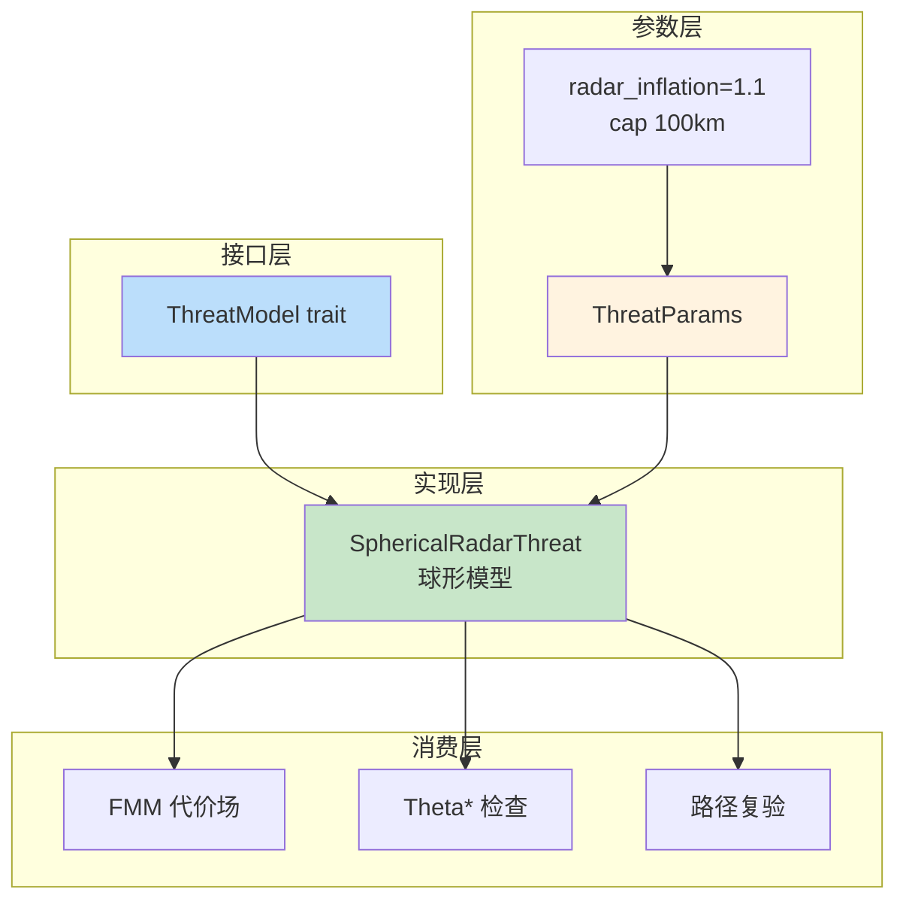
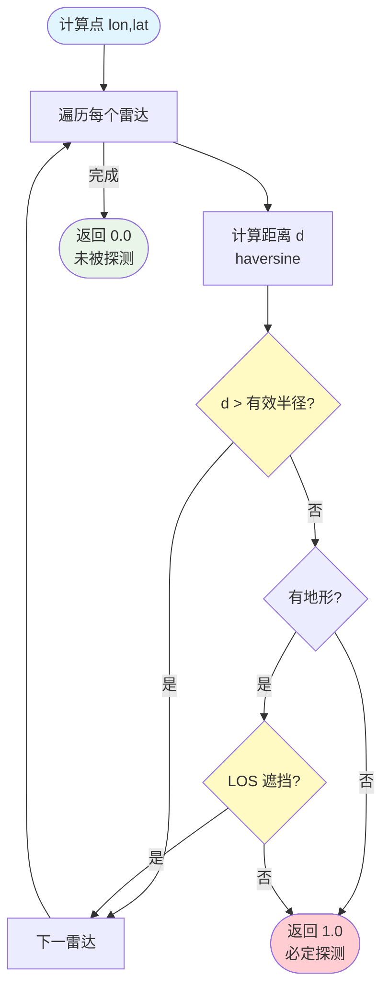
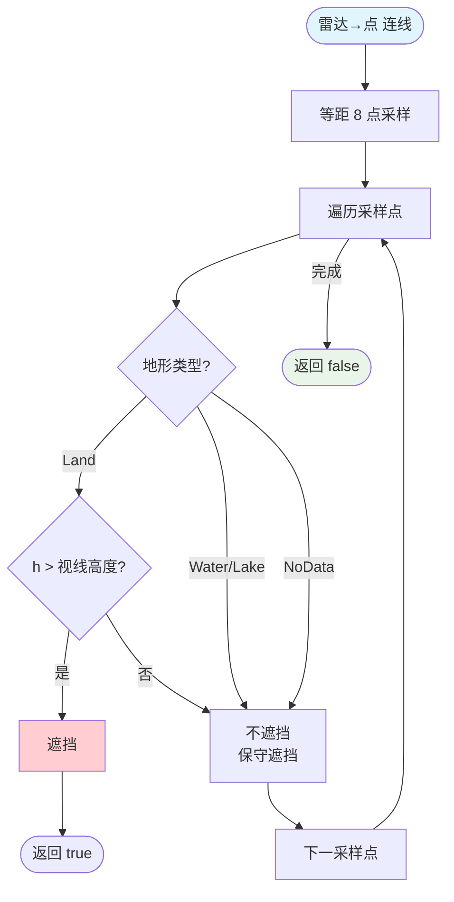

# 03 — 雷达威胁模型

> 设计依据：技术方案 4.2.1（雷达威胁代价形态/多雷达合成/压制）、4.3（ThreatModel trait）

## 1. 设计定位

威胁模型是"球形模型 + 二值检测 + LOS 地形遮蔽 + 多雷达（任一探测即探测）"：

- 球形模型：水平距离 ≤ 有效半径内视为威胁
- **二值检测**：飞机在雷达有效半径内且 LOS 未遮蔽 = 必定被探测（p=1.0），否则 p=0
- 多雷达：任一雷达探测到即返回 1.0
- LOS：地形遮挡雷达视线 → 该雷达不探测

## 2. 威胁模型架构



## 3. ThreatParams（威胁模型参数）

```rust
pub struct ThreatParams {
    pub radar_inflation: f64,    // 膨胀系数（内部常量 1.1，cap 100km，不可外部覆盖）
}
```

## 4. 有效半径计算

```
effective_radius_m = radius_km × 1000 × radar_inflation
```

其中 `radar_inflation = 1.1`，`effective_radius_m` 上限 100km。

## 5. 单点探测判定（二值）



**判定逻辑**：
- 距离 ≤ 有效半径 + LOS 未遮蔽 → p = 1.0（必定被探测）
- 否则 → p = 0
- 多雷达：任一雷达返回 1.0 即最终为 1.0

## 6. LOS 判定流程



## 7. 雷达代价进入 FMM

```
对每格点:
    p = threat.static_detected(lon, lat)   // 0 或 1
    if p > 0 && cost 有限:
        u = threat.static_penetration(lon, lat, 0.0)
        geom = (u < 1.0) ? (1.0 − u) : 0.0
        cost *= 1 + 200 × (p + geom)   # radar_cost_coef 内部常量 200
```

数值效果：探测圈内（p=1）全区域强绕行，圈外 p=0 无惩罚。

## 8. 与设计的差异/占位

| 项 | 状态 |
|----|------|
| 二值检测模型 | ✅ 范围内 + LOS 未遮蔽 = 必定探测 |
| LOS mask 乘子进代价场 | ✅ 有地形时自动启用 LOS 遮蔽（无需外部参数） |
| radar_inflation 内部常量 | ✅ 1.1，cap 100km，不可外部覆盖 |
| radar_cost_coef 内部常量 | ✅ 200，不可外部覆盖 |
| 探测概率随暴露时间相关 | 未显式建模（路径评估为空间采样） |

## 9. 测试覆盖

- 二值检测正确性（范围内/外）
- 多雷达任一探测
- LOS 山脊遮挡
- 路径评估二值判定
- crash_suite：空雷达、畸形参数不 panic
