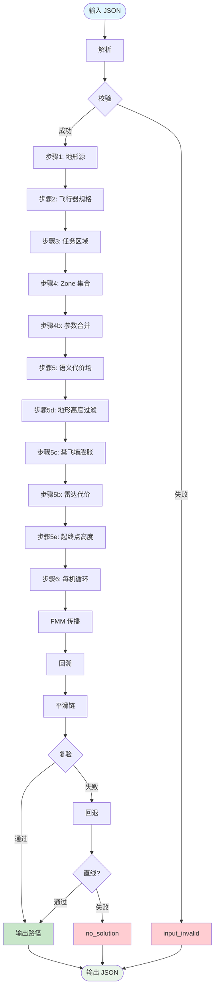
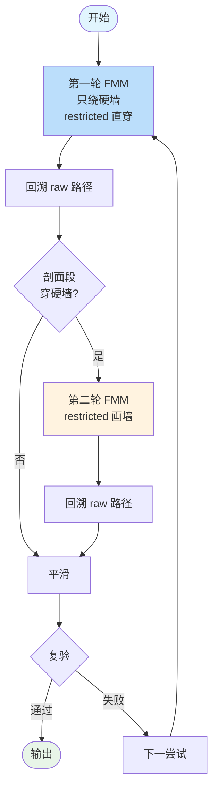
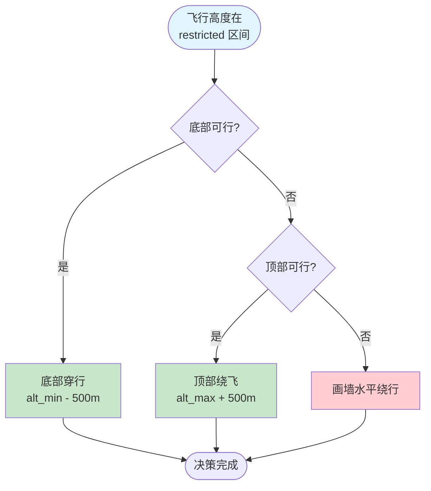
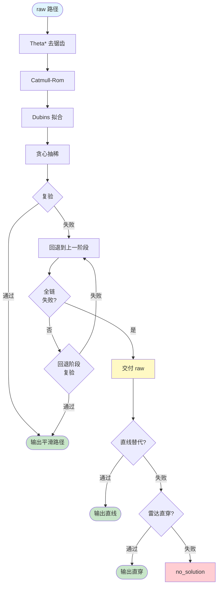
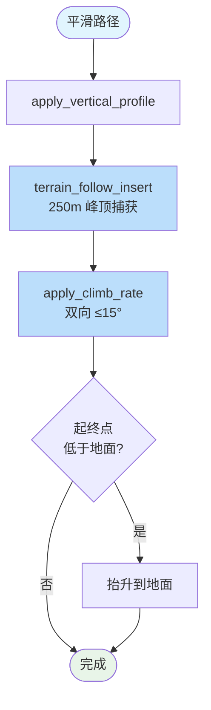

# 04 — 求解器与端到端流程

> 设计依据：技术方案 Phase 4 M1–M5

## 1. 职责

`solver::solve` 把库层组件串成主流程。

**M1 范围**：单机/多机（共享代价场，每机独立 FMM）；Zone 水平几何禁入（高度层 M2）；SmoothOptions 默认值（AircraftProfile 派生 M4）；雷达代价（M3）；逐机显式 target（M5）。

## 2. 求解器主流程

## 3. 两轮 FMM 机制

## 4. 受限区剖面决策

**底部可行条件**：
- bottom ≥ 0（负高不可行）
- 爬升距离够
- 穿行带地形可行

**顶部可行条件**：
- 爬升距离够
- top ≤ 升限

## 5. 平滑链 + 回退机制

**关键决策**：不交付违禁路径——平滑全失败 + 直线替代均失败 → no_solution。

## 6. 垂直剖面后处理（方案 B）

**方案 B 核心**：
- 起终点保持用户高度（硬约束）
- 中间段抬升决策记录撞山区段最高地形点 → 自动中间锚点
- terrain_follow_insert：段内 250m 加密采样找最差峰插点
- apply_climb_rate：限制相邻路径点坡度 ≤ 15°

## 7. 与设计的差异/占位

| 项 | 状态 |
|----|------|
| 无解出口链 | ✅ 已实现（点目标回退、网格细分、直线替代等） |
| 3s 预算硬护栏 | ✅ 已实现（`SolveParams.time_budget_ms`） |
| 多机交叉检测 | ✅ 已实现（两两段-段水平/垂直距离检测） |
| 环带目标 | ✅ 已实现（FMM 传播到环带即停） |
| 垂直剖面 | ✅ 已实现（方案 B + 地形跟随 + 爬升率约束） |

## 8. 测试覆盖

- 端到端直航、目标被禁飞覆盖 no_solution
- 双禁飞区平滑、受限区底部/顶部决策
- zigzag 系列回归（真实地形）
- 输入点越界按高代价通行
- smoothing_failed 不交付 raw