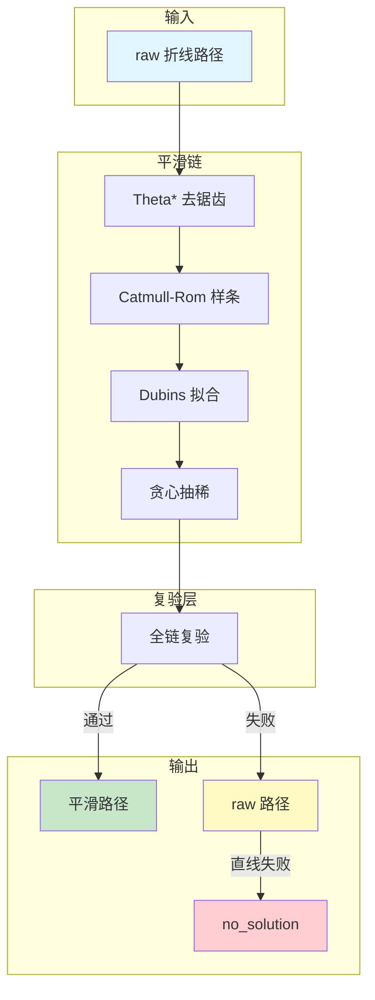
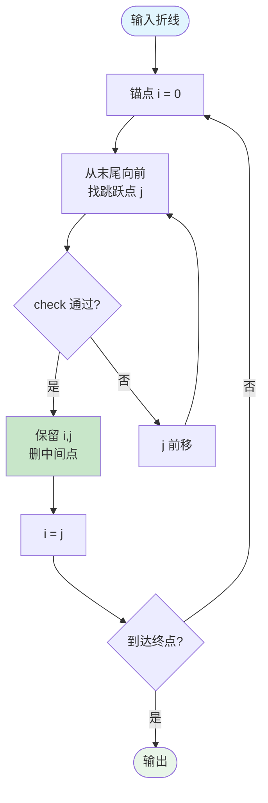
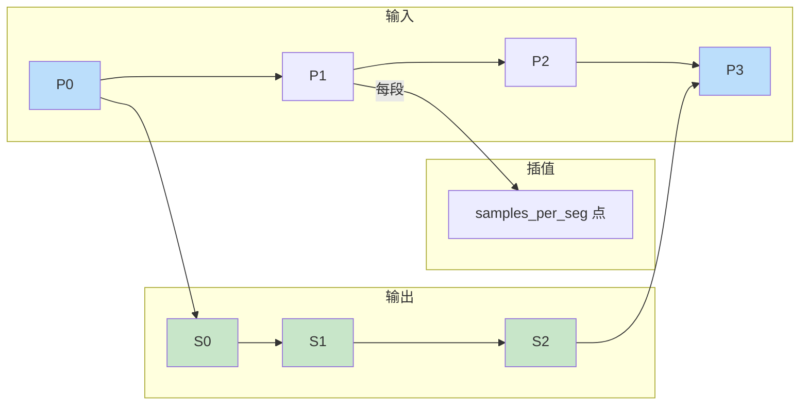
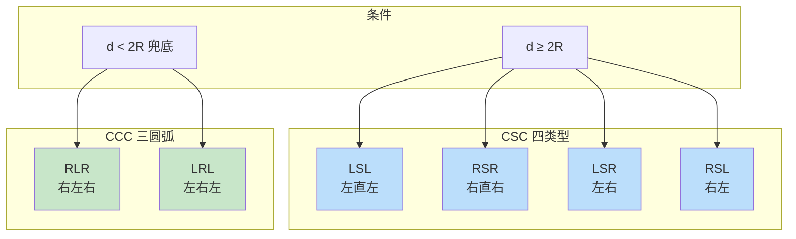
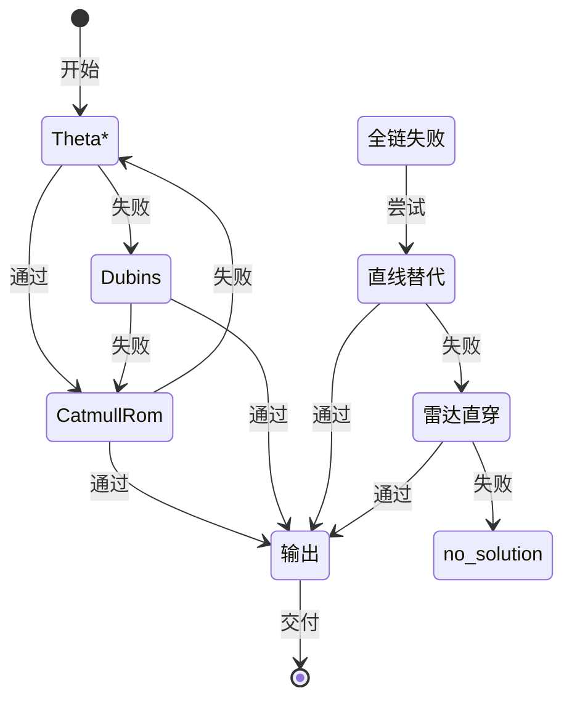
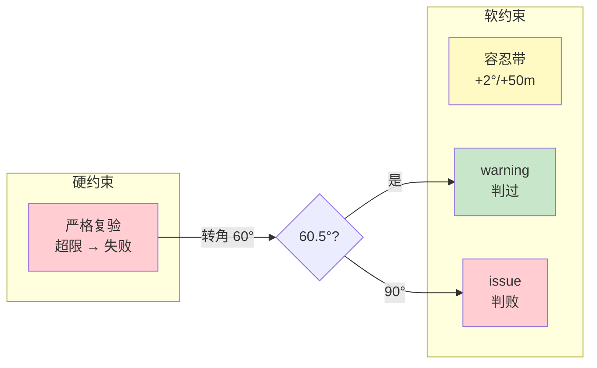

# 05 — 路径平滑与全链复验

> 本节描述路径平滑与全链复验。

## 1. 设计定位

输出美化链——**纯几何后处理**：输入折线路径，输出平滑路径。

**默认链序**：Theta\* 去锯齿 → Dubins/样条拟合 → 贪心抽稀 → 弦高/运动学复验。

**优先级**：安全（不撞山/不越禁飞）> 运动学约束 > 美化。

**回退语义**：任一复验失败回退上一策略环节；全链失败 → 交付美化前原始折线 + 告警 `smoothing_failed`；**solver 出口**：raw 回退后若直线替代/雷达直穿替代均失败 → **no_solution，不交付 raw**。

## 2. 平滑链架构



## 3. 平滑算法流程

### 3.1 Theta\* 去锯齿



**关键特性**：
- LOS 捷径简化——贪心跳点
- max_turn_deg 约束相邻航段转角
- 复杂度 O(n²)（点列短，可接受）

### 3.2 Catmull-Rom 样条



### 3.3 Dubins 路径类型



## 4. 全链复验流程

```mermaid
flowchart TD
    START([输入路径]) --> CHECK1[航向连续性<br>转角 ≤ max_turn_deg]
    CHECK1 --> CHECK2[转弯半径<br>外接圆 ≥ turn_radius]
    CHECK2 --> CHECK3[爬升角<br>≤ tan(max_climb)]
    CHECK3 --> CHECK4[地形净空<br>alt ≥ h + clearance]
    CHECK4 --> CHECK5[禁飞/限飞<br>段净距 ≥ inflation]
    CHECK5 --> CHECK6[弦高<br>≤ chord_tol_m]
    CHECK6 --> CHECK7[A6 物理自洽<br>turn_radius ≥ phys_min]
    CHECK7 --> CHECK8[雷达威胁<br>进入探测区 → warning]

    CHECK8 --> RESULT{全部通过?}
    RESULT -->|是| PASS([通过])
    RESULT -->|否| FAIL([失败])

    style START fill:#e1f5fe
    style PASS fill:#c8e6c9
    style FAIL fill:#ffcdd2
```

**复验清单**：

| 检查项 | 规则 | 机型 |
|--------|------|------|
| 航向连续性 + 转角 | ≤ max_turn_deg | 固定翼 |
| 转弯半径 | 外接圆半径 ≥ turn_radius_m × 0.99 | 固定翼 |
| 爬升角 | ≤ tan(max_climb_deg) | 固定翼 |
| 地形净空 | Land: alt ≥ h + clearance；NoData/OOB: 降级警告不阻断 | 两机型 |
| 禁飞/限飞包含 | 硬墙：段净距 < inflation 拒绝；Restricted：解析求交 + 高度判定 | 两机型 |
| 弦高 | ≤ chord_tol_m | 两机型 |
| A6 物理自洽 | turn_radius ≥ phys_min_radius_m | 固定翼 |
| 雷达威胁 | 路径进入雷达探测区 → warning（软告警） | 两机型 |

**机型分支**：旋翼机跳过固定翼运动学硬拦；净空/禁飞/弦高对两机型一律硬约束。

## 5. 回退机制



**关键决策**：不交付违禁路径——平滑全失败 + 直线替代均失败 → no_solution。

## 6. 软项容忍带



**容忍带**：转角 +2° / 半径 0.95 / 弦高 +50m / 爬升角 +2°

## 7. 与设计的差异/占位

| 项 | 状态 |
|----|------|
| CCC Dubins | ✅ 已实现（RLR/LRL 三圆弧） |
| 复验器独立数据路径 | ✅ 已实现（verify 走全分辨率逐段采样） |
| 3D Dubins | 2D Dubins + 高程剖面独立插值 |

## 8. 测试覆盖

- path：haversine、bearing、点到线段距离、角差、路径长度
- dubins：LSL、LSR、同点零长、CCC、非有限 None
- smooth：Theta\*/Chaikin/Catmull 端点、Dubins 拟合、策略链回退
- verify：软项容忍带、smoothing_failed 不交付 raw
- zigzag 回归（真实地形）